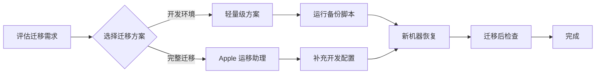

## 概述

换新 Mac 是一件开心的事，但重新配置开发环境却往往耗费大量时间。本指南提供了一套**系统化、可复现**的 macOS 开发环境迁移解决方案，帮助你快速在新机器上恢复工作环境。

## 为什么需要这份指南？

::: tip 核心价值
- **节省时间**：从数天配置缩短到数小时完成
- **避免遗漏**：清单式检查确保环境完整
- **可重复性**：脚本化操作让下次迁移更简单
- **最佳实践**：融合官方工具和开发者经验
:::

## 适用场景

| 场景 | 推荐方案 |
|------|---------|
| 换新 Mac，想完整迁移所有数据 | [Apple 迁移助理](/official-tools) |
| 开发者，只想迁移开发环境 | [轻量级迁移方案](/quick-start) |
| 定期备份开发配置 | [自动化脚本](/scripts) |
| 多台 Mac 同步开发环境 | [配置文件管理](/config/dotfiles) |

## 迁移流程概览

## 开始使用

选择你需要的迁移方式：

**[🚀 快速开始](/quick-start)** - 5 分钟了解迁移流程

**[🛠️ 官方工具](/official-tools)** - 使用 Apple 迁移助理

**[⚙️ 开发环境](/dev-env/homebrew)** - Homebrew、Node.js、Python

**[📝 配置文件](/config/dotfiles)** - dotfiles 和 SSH 备份

**[🔄 自动化](/scripts)** - 备份和恢复脚本

**[✅ 检查清单](/post-migration/checklist)** - 迁移后验证

