# 快速开始

本指南提供多种 macOS 开发环境迁移方案，根据你的需求选择合适的方式。

## 三分钟了解迁移方案

<details>
<summary><strong>📖 我应该选择哪种迁移方式？</strong></summary>

根据不同场景选择：

- **换新 Mac**：使用 [Apple 迁移助理](/official-tools) 完整迁移
- **只想迁移开发环境**：使用 [轻量级方案](#轻量级迁移流程)
- **定期备份配置**：使用 [自动化脚本](/scripts)
- **多台 Mac 同步**：使用 [iCloud + dotfiles](/config/dotfiles)

</details>

## 轻量级迁移流程

这是最推荐的开发者迁移方案，耗时约 1-2 小时。

```mermaid
flowchart LR
    A[旧 Mac<br/>导出配置] --> B[外接存储<br/>或云同步]
    B --> C[新 Mac<br/>安装基础工具]
    C --> D[恢复配置]
    D --> E[安装开发工具]
    E --> F[验证环境]
```



### Step 1: 旧 Mac 上导出配置

```bash
# 创建备份目录
mkdir -p ~/macos-migrate/{config,pkg}

# 导出 Homebrew 包列表
brew bundle dump --file=~/macos-migrate/pkg/Brewfile --describe

# 导出 Node 版本
nvm ls > ~/macos-migrate/pkg/nvm-versions.txt

# 导出全局 npm 包
npm list -g --depth=0 > ~/macos-migrate/pkg/npm-global.txt

# 导出 Python 版本
pyenv versions > ~/macos-migrate/pkg/python-versions.txt

# 复制配置文件
cp ~/.zshrc ~/.zprofile ~/.gitconfig ~/.npmrc ~/macos-migrate/config/
cp -r ~/.ssh ~/macos-migrate/config/

# 导出 VS Code 扩展
code --list-extensions > ~/macos-migrate/config/vscode-extensions.txt
```

### Step 2: 同步到新 Mac

```bash
# 方式一：外接硬盘（推荐）
cp -r ~/macos-migrate /Volumes/YourDrive/

# 方式二：通过 AirDrop 或 iCloud
# 将 macos-migrate 文件夹传输到新 Mac
```

### Step 3: 新 Mac 上恢复

```bash
# 安装 Homebrew
/bin/bash -c "$(curl -fsSL https://raw.githubusercontent.com/Homebrew/install/HEAD/install.sh)"

# 恢复 Homebrew 包
brew bundle --file=~/macos-migrate/pkg/Brewfile

# 安装 nvm 并恢复 Node 版本
curl -o- https://raw.githubusercontent.com/nvm-sh/nvm/v0.39.7/install.sh | bash
while read version; do nvm install "$version"; done < ~/macos-migrate/pkg/nvm-versions.txt

# 恢复全局 npm 包
cat ~/macos-migrate/pkg/npm-global.txt | xargs npm install -g

# 恢复配置文件
cp ~/macos-migrate/config/.zshrc ~/macos-migrate/config/.zprofile ~/macos-migrate/config/.gitconfig ~/
cp -r ~/macos-migrate/config/.ssh ~/

# 恢复 VS Code 扩展
cat ~/macos-migrate/config/vscode-extensions.txt | xargs -L 1 code --install-extension
```

### Step 4: 验证环境

参考 [迁移后检查清单](/post-migration/checklist) 确保一切正常。

## 使用自动化脚本

如果你希望一键完成上述操作，可以使用我们提供的 [自动化脚本](/scripts)：

```bash
# 在旧 Mac 上备份
./scripts/backup.sh

# 在新 Mac 上恢复
./scripts/restore.sh
```

## 下一步

- [官方迁移工具详解](/official-tools) - 了解 Apple 迁移助理
- [迁移策略对比](/strategies) - 三种方案的详细对比
- [配置文件备份](/config/dotfiles) - 深入了解 dotfiles 管理
