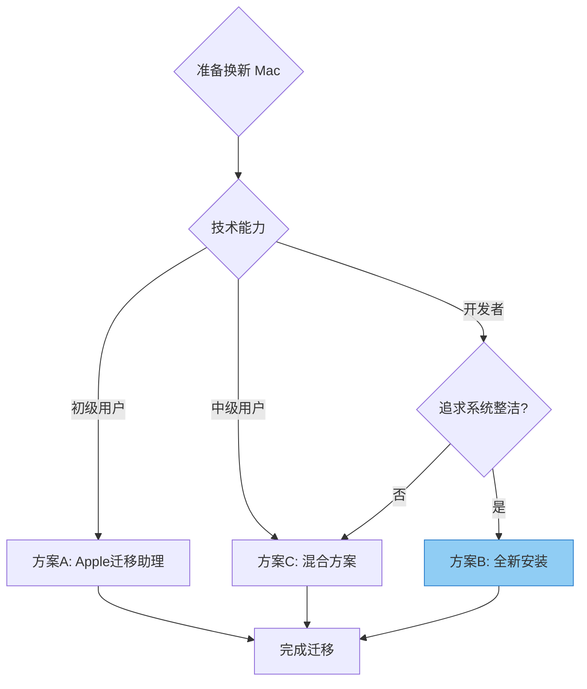

# 迁移策略选择

根据你的具体情况，选择最合适的迁移策略可以事半功倍。

## 三种迁移方案对比

| 对比维度 | **方案 A：Apple 迁移助理** | **方案 B：全新安装 + 恢复配置** ⭐ | **方案 C：混合方案** |
|:---:|:---|:---:|:---|
| **方案定位** | 完整迁移方案 | 开发者首选 | 折中方案 |
| **方案描述** | 使用官方工具迁移全部数据 | 新机全新安装，只恢复开发配置 | 用户数据用迁移助理，开发环境手动恢复 |
| **技术门槛** |   |   |   |
| **耗时估算** |  |  |  |
| **优点** | • 零门槛，官方引导<br>• 保留所有应用和数据<br>• 不遗漏任何配置 | • 系统干净，无历史包袱<br>• 只迁移需要的内容<br>• 重新审视工具必要性 | • 平衡效率和灵活性<br>• 用户数据无忧<br>• 开发环境可控 |
| **缺点** | • 耗时最长<br>• 迁移大量无用文件<br>• 可能带入旧系统问题 | • 需要一定技术能力<br>• 部分应用需手动配置 | • 需要运行两次迁移<br>• 可能有部分重复 |
| **适用场景** | • 第一次换 Mac<br>• 非技术用户<br>• 需要保留所有数据 | • 有一定技术基础<br>• 追求系统整洁<br>• 开发者/技术人员 | • 需要保留用户文档<br>• 开发环境想重新配置<br>• 中级技术用户 |
| **推荐指数** | ⭐⭐⭐ | ⭐⭐⭐⭐⭐ | ⭐⭐⭐⭐ |

<style>
.comparison-summary {
  margin-top: 2rem;
  padding: 1.5rem;
  background: var(--vp-c-bg-soft);
  border-left: 4px solid var(--vp-c-brand);
  border-radius: 8px;
}
.comparison-summary h4 {
  margin-top: 0;
  color: var(--vp-c-text-1);
}
.comparison-summary p {
  margin-bottom: 0;
}
</style>

<div class="comparison-summary">

### 💡 如何选择？

- **新手用户 / 首次换 Mac** → 选择 **方案 A**，让官方工具帮你完成一切
- **开发者 / 技术人员** → 选择 **方案 B**（推荐），获得干净清爽的新系统
- **有重要用户文档** → 选择 **方案 C**，数据安全两不误

</div>

---

## 方案 B 详细步骤（推荐）

### 阶段一：旧 Mac 备份（30 分钟）

```bash
# 1. 运行备份脚本
git clone https://github.com/yourusername/macos-migrate.git
cd macos-migrate
./scripts/backup.sh

# 2. 验证备份
ls -la ~/macos-migrate/
# 确认以下文件已生成：
# - pkg/Brewfile
# - pkg/nvm-versions.txt
# - pkg/npm-global.txt
# - config/.zshrc
# - config/.gitconfig
# - config/.ssh/
```

### 阶段二：数据转移（视数据量）

```bash
# 方式一：外接 SSD（推荐，速度最快）
cp -r ~/macos-migrate /Volumes/YourSSD/

# 方式二：iCloud Drive（适合配置文件）
mv ~/macos-migrate ~/Library/Mobile\ Documents/com~apple~CloudDocs/

# 方式三：GitHub 私有仓库（适合 dotfiles）
cd ~/macos-migrate
git init && git add . && git commit -m "Initial backup"
git remote add origin https://github.com/yourusername/dotfiles.git
git push -u origin main
```

### 阶段三：新 Mac 恢复（1-2 小时）

```bash
# 1. 基础系统设置
- 完成系统初始化向导
- 登录 Apple ID
- 启用 FileVault 磁盘加密
- 配置 Touch ID

# 2. 安装 Xcode Command Line Tools
xcode-select --install

# 3. 安装 Homebrew
/bin/bash -c "$(curl -fsSL https://raw.githubusercontent.com/Homebrew/install/HEAD/install.sh)"

# 4. 运行恢复脚本
./scripts/restore.sh

# 5. 重启终端，加载新配置
```

### 阶段四：验证与补充（30 分钟）

参考 [迁移后检查清单](/post-migration/checklist) 逐一验证。

## 方案 B 详细步骤（推荐）

### 阶段一：旧 Mac 备份（30 分钟）

```bash
# 1. 运行备份脚本
git clone https://github.com/yourusername/macos-migrate.git
cd macos-migrate
./scripts/backup.sh

# 2. 验证备份
ls -la ~/macos-migrate/
# 确认以下文件已生成：
# - pkg/Brewfile
# - pkg/nvm-versions.txt
# - pkg/npm-global.txt
# - config/.zshrc
# - config/.gitconfig
# - config/.ssh/
```

### 阶段二：数据转移（视数据量）

```bash
# 方式一：外接 SSD（推荐，速度最快）
cp -r ~/macos-migrate /Volumes/YourSSD/

# 方式二：iCloud Drive（适合配置文件）
mv ~/macos-migrate ~/Library/Mobile\ Documents/com~apple~CloudDocs/

# 方式三：GitHub 私有仓库（适合 dotfiles）
cd ~/macos-migrate
git init && git add . && git commit -m "Initial backup"
git remote add origin https://github.com/yourusername/dotfiles.git
git push -u origin main
```

### 阶段三：新 Mac 恢复（1-2 小时）

```bash
# 1. 基础系统设置
- 完成系统初始化向导
- 登录 Apple ID
- 启用 FileVault 磁盘加密
- 配置 Touch ID

# 2. 安装 Xcode Command Line Tools
xcode-select --install

# 3. 安装 Homebrew
/bin/bash -c "$(curl -fsSL https://raw.githubusercontent.com/Homebrew/install/HEAD/install.sh)"

# 4. 运行恢复脚本
./scripts/restore.sh

# 5. 重启终端，加载新配置
```

### 阶段四：验证与补充（30 分钟）

参考 [迁移后检查清单](/post-migration/checklist) 逐一验证。

## 决策流程图



## 特殊场景建议

### 场景一：公司电脑换新

```bash
# 建议：方案 B + 公司工具配合
1. 使用公司标准镜像全新安装
2. 恢复个人开发配置
3. 安装公司必需的工具
```

### 场景二：同时使用两台 Mac

```bash
# 建议：iCloud + Git 同步
1. 配置文件放 iCloud Drive
2. dotfiles 用 GitHub 管理
3. 定期同步 Brewfile
```

### 场景三：经常重装系统

```bash
# 建议：自动化脚本优先
1. 完善 backup.sh 和 restore.sh
2. 配置文件版本控制
3. 记录独特配置项
```

## 下一步

选定方案后，继续阅读：
- [开发环境迁移](/dev-env/homebrew) - Homebrew、Node、Python 配置
- [配置文件备份](/config/dotfiles) - dotfiles 管理详解
- [自动化脚本](/scripts) - 一键备份和恢复
